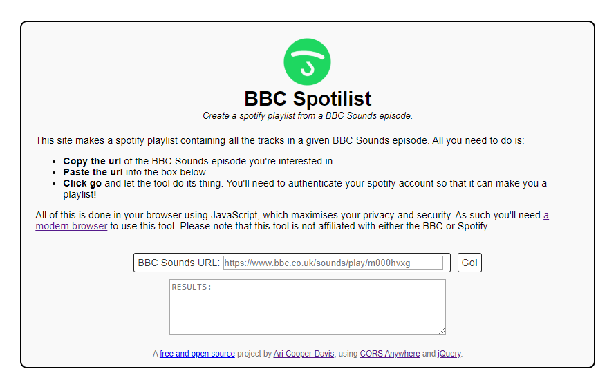

# BBC Spotilist
*Create a spotify playlist from a BBC Sounds episode*

[BBC Spotilist](https://aricooperdavis.github.io/BBC-Spotilist) is a site, written in JavaScript, that automates the creation of new Spotify playlists containing tracks listed on a BBC Sounds episode.

## Get Started
### Online Demo Site
Try out the [fully functional demo-site](https://aricooperdavis.github.io/BBC-Spotilist/) built from this repository and running on GitHub pages. Note, however, that the demo site is using the [demo implementation of CORS Anywhere](https://github.com/Rob--W/cors-anywhere/#demo-server), which has strict service limits.

### Host Locally
Clone the repository, navigate into the main folder, and start an http server. Any server will do, but my favourite is:

`python -m http.server`

Then, in your browser navigate to:

`localhost:8000`

And you will be able to use the site.

As mentioned, it's currently coded to use the [demo implementation of CORS Anywhere](https://github.com/Rob--W/cors-anywhere/#demo-server), and you should consider hosting your own version.

If you would like to build on this project then you should also consider registering a [spotify developer client ID](https://developer.spotify.com/dashboard/applications) so that you're not using mine.

## Contributing
Please do - by filing any [issues](https://github.com/aricooperdavis/BBC-Spotilist/issues) you encounter or any [enhancements](https://github.com/aricooperdavis/BBC-Spotilist/labels/enhancement) you can think of, or even better by coding up those improvements yourself and making a [pull request](https://github.com/aricooperdavis/BBC-Spotilist/pulls).

## Acknowledgements
Many thanks to the developers of [CORS Anywhere](https://github.com/Rob--W/cors-anywhere/) and [jQuery](https://github.com/jquery/jquery) whos exceptional hard work made this project simple.
